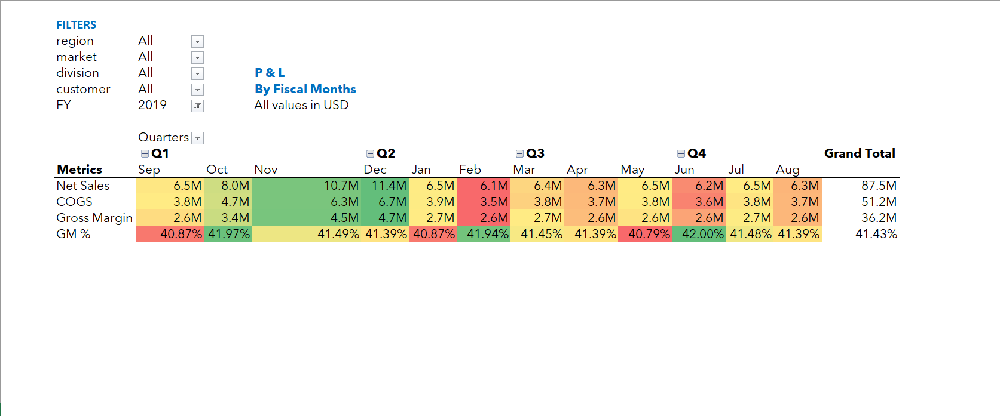
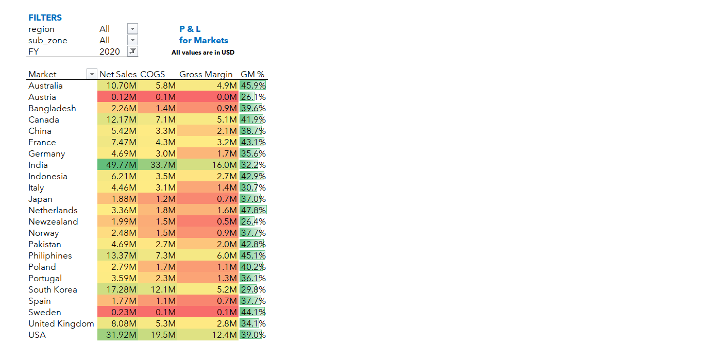
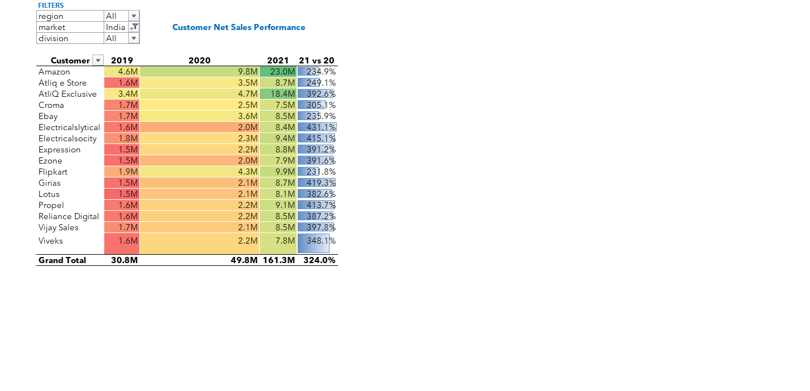
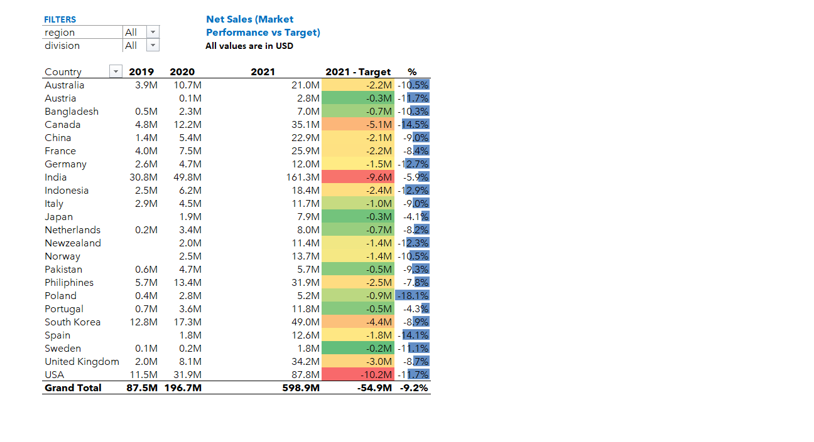

# 💼 AtliQ Hardware – Global Sales Performance Analysis (Excel BI Project)

An **end-to-end Excel Business Intelligence (BI)** project analyzing **AtliQ Hardware’s global sales and profitability performance** across multiple fiscal years, customers, and markets.  

This project demonstrates how Microsoft Excel can be used as a **complete BI solution** — integrating **Power Query, Power Pivot, and DAX** to deliver interactive, data-driven dashboards for real business insights.

---

## 🎯 Project Objectives

- Build an integrated **Excel BI system** using Power Query, Power Pivot, and DAX.  
- Analyze **Net Sales, COGS, and Gross Margin %** across multiple fiscal years.  
- Evaluate **market-wise** and **customer-wise** profitability.  
- Compare **target vs actual performance** for global markets.  
- Deliver **interactive dashboards** that support management-level decisions.

---

## ⚙️ Workflow Overview

### 1️⃣ Data Preparation (Power Query)
- Imported raw sales data from multiple Excel sources.  
- Cleaned and standardized datasets (handled blanks, renamed columns, removed duplicates).  
- Built a **custom Date Table** with calculated columns for:
  - Fiscal Year  
  - Fiscal Month  
  - Month Order  
  - Month Name  

> ⚙️ *Note:* Source connections are disabled in this version for portability.  
> The final Excel model retains all transformations and logic used during data preparation.

---

### 2️⃣ Data Modeling (Power Pivot)
Structured a **Star Schema** model connecting fact and dimension tables:

| Fact Table | Dimension Tables |
|-------------|------------------|
| `Sales_Fact` | `dim_customer`, `dim_market`, `dim_product`, `dim_date` |

Relationships were built using:
- `Customer Code`  
- `Product Code`  
- `Market`  
- `Date`

---

### 3️⃣ DAX Measures
Created key measures using **DAX** for analytical flexibility:

- **Net Sales** = `SUM(Sales[Net_Sales])`  
- **Gross Margin** = `[Net Sales] - [COGS]`  
- **GM %** = `DIVIDE([Gross Margin], [Net Sales], 0)`  
- **Net Sales FY21 / FY22 / FY23** via `CALCULATE()` and filter context  

---

### 4️⃣ Dashboard Design
Four interactive dashboards were created to visualize business performance from different perspectives:

#### 📆 Fiscal Year Analysis  
> Tracks Net Sales, COGS, and GM% across fiscal months.  

#### 🌍 Market Insights  
> Compares profitability across global markets using color-coded heatmaps.  

#### 👥 Customer Performance  
> Displays YoY sales growth and contribution of top customers.  

#### 🎯 Market vs Target Performance  
> Highlights performance gaps between targets and actuals for each region.  

---

## 📊 Key Insights

- **India**, **USA**, and **Canada** emerged as top markets driving global revenue.  
- **Gross Margin %** remained steady at ~41–42%, indicating operational efficiency.  
- **Rising COGS** affected profitability in certain European regions.  
- **AtliQ Exclusive** and **Croma** showed exceptional YoY growth (300%+).  

---

## 🧩 Tools & Technologies Used

| Tool | Purpose |
|------|----------|
| **Microsoft Excel** | Data modeling, analysis, and visualization |
| **Power Query** | ETL — Data extraction, cleaning, and transformation |
| **Power Pivot** | Data modeling and establishing relationships |
| **DAX** | KPI calculations and financial metrics |
| **Conditional Formatting & Slicers** | Interactive visualization layer |

---

## 📈 Learnings

- Built a **complete Excel-based BI architecture** (Power Query → Power Pivot → Dashboard).  
- Created **custom DAX measures** for dynamic reporting.  
- Applied **Star Schema design** for optimal model performance.  
- Designed **executive-level dashboards** replicating enterprise BI workflows.  

---

## 📁 Project Files

| File | Description |
|------|--------------|
| `Excel Project (P & L by months).xlsx` | Fiscal-wise Profit & Loss report |
| `Excel Project (P & L by markets).xlsx` | Market-wise profitability analysis |
| `Excel Project (Customer Net Sales Report).xlsx` | Customer performance comparison |
| `Excel Project (Market Performance vs Target).xlsx` | Regional performance vs targets |

🔗 [Download Excel Project (Google Drive)](YOUR_EXCEL_PROJECT_DRIVE_LINK_HERE)

---

## 🧠 Data Model (Power Pivot)

Star Schema built using fact and dimension relationships for accurate aggregation and time intelligence.  

---

## 👨‍💻 About Me

I’m **Yash Hooda**, an aspiring **Data Analyst** passionate about transforming raw data into powerful business insights using **Excel, Power BI, and SQL**.  
I aim to bridge data and decision-making with intuitive, visually rich analytics.

📍 *Rohtak, Haryana, India*  
📫 **yash111vision@gmail.com**  
🌐 [GitHub](https://github.com/11Yash1) | [LinkedIn](https://www.linkedin.com/) *(coming soon)*  

---

⭐ *If you found this project insightful, don’t forget to star the repository!*  

---

### 💡 Why This Project Stands Out
- Demonstrates **Excel as a complete BI ecosystem** (ETL → Modeling → Visualization).  
- Built using **enterprise reporting standards** used in firms like Deloitte, PwC & KPMG.  
- Realistic business use case: **global multi-year profitability and sales performance**.  
- Clean design, clear storytelling, and technically rich modeling prove full-stack Excel BI mastery.  

---

**Tags:** `#Excel` `#PowerQuery` `#PowerPivot` `#DAX` `#DataAnalytics` `#BusinessIntelligence` `#AtliQ` `#FinanceDashboard`
